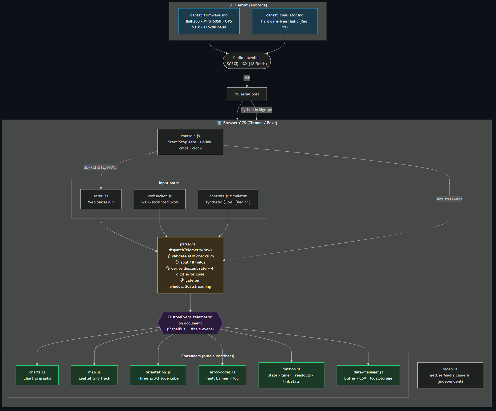
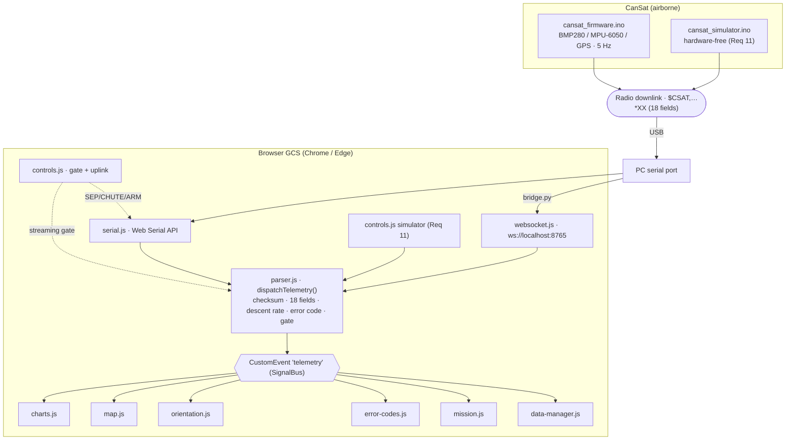

# CanSat GCS — Architecture

How the Ground Control Station is put together, why it's shaped this way, and
where each responsibility lives. For the exact field order, DOM ids and global
names, see [`../CONTRACT.md`](../CONTRACT.md); for how to run it, see
[`../README.md`](../README.md).



> The PNG above is generated from [`architecture.mmd`](architecture.mmd). The
> same diagram is inlined as Mermaid at the bottom of this file, so it also
> renders directly on GitHub.

---

## 1. The one idea that shapes everything

**Telemetry has exactly one entry point and one event.**

`parser.js` is the *only* module that understands the wire format. It exposes a
single function — `dispatchTelemetry(rawLine)` — and emits a single browser
`CustomEvent` named `telemetry` on `document`. Every other module is a **pure
consumer**: it does `document.addEventListener('telemetry', …)` and never talks
to the serial port, the socket, or any sibling module.

This is a lightweight **SignalBus** pattern. Its payoffs:

- The wire format lives in **one file**. Add a field → change `parser.js` only.
- Consumers are **independent and unaware of each other** — you can delete
  `map.js` and nothing else breaks.
- The same event feeds hardware data, WebSocket data, and simulated data with
  zero special-casing downstream.

---

## 2. Data flow, end to end

```
CanSat sensors → firmware builds $CSAT packet (XOR checksum) → radio downlink
      → USB → PC
          → serial.js  (Web Serial API)          ┐
          → websocket.js (via Python bridge.py)   ├─→ dispatchTelemetry(raw)
          → controls.js simulator (synthetic)     ┘        │
                                                           ▼
                                              parser.js validates + enriches
                                                           │
                                       CustomEvent 'telemetry' on document
                                                           │
        ┌──────────┬───────────┬────────────┬─────────────┼───────────────┐
        ▼          ▼           ▼            ▼             ▼               ▼
    charts.js   map.js   orientation.js  error-codes.js  mission.js   data-manager.js
```

There are **three input paths** but only **one funnel**. Web Serial, the
WebSocket bridge, and the built-in simulator all call the exact same
`dispatchTelemetry(rawLine)`, so every path is decoded and validated identically.

---

## 3. What parser.js does to each line

1. **Validate the XOR checksum** — everything between `$` and `*`, compared
   case-insensitively against the 2 hex digits after `*`. Bad packets are logged
   and dropped, never rendered.
2. **Split the 18 fields** into a typed object (numbers, booleans).
3. **Derive two quantities that are *not* on the wire:**
   - `descentRate` = `(prevAlt − alt) / dt` using module-level previous
     altitude + timestamp (positive = falling).
   - `errorCode` — a 4-character string, one digit per fault condition
     (see §5).
4. **Gate on `window.GCS.streaming`.** If the master Start/Stop gate is off,
   `dispatchTelemetry` returns early and nothing is emitted.

---

## 4. The master streaming gate

`window.GCS = { streaming: false }`. Connecting a link (serial or WebSocket)
**does not** start rendering — it only opens the pipe. The **Start** button
flips `streaming` to `true`; **Stop** flips it back. This gives the operator a
clean "arm the display" moment and guarantees the graphs/map/cube begin from a
known state. On Start, `parser.js`'s altitude-derivative history is reset so the
first packet after a Stop→Start can't compute a bogus descent rate.

---

## 5. The 4-digit error code (derived, never transmitted)

The firmware deliberately keeps the fault code **off the wire** — the GCS
computes it in `parser.js` so the logic is unit-testable in the browser.

| Digit | Fault               | = 1 when …                                     |
|:-----:|---------------------|------------------------------------------------|
| d1    | Descent rate        | `state == 3 (DESCENT)` and rate ∉ **[8,10] m/s** |
| d2    | GPS availability    | `gpsFix == 0`                                   |
| d3    | Payload separation  | `state >= 3` and payload not separated          |
| d4    | Emergency parachute | parachute deployed                              |

`0000` = all nominal · `1111` = all faults. Phase-gating (d1/d3 only arm from
DESCENT onward) prevents false alarms on the pad and during ascent.

---

## 6. Module responsibilities

| Module            | Role                                                              |
|-------------------|------------------------------------------------------------------|
| `parser.js`       | **Sole producer.** Wire decode, checksum, derived fields, event. |
| `serial.js`       | Web Serial API connect/read loop; `sendCommand()` uplink.        |
| `websocket.js`    | WebSocket client for the optional Python bridge.                 |
| `charts.js`       | Chart.js scrolling graphs; combined PNG export (`exportGraphs`). |
| `map.js`          | Leaflet GPS polyline + live marker; `invalidateSize` on resize.  |
| `orientation.js`  | Three.js attitude cube via complementary filter (roll/pitch/yaw).|
| `video.js`        | `getUserMedia` camera feed + snapshot (independent of telemetry).|
| `error-codes.js`  | 4-digit fault banner, digit LEDs, timestamped event log.         |
| `mission.js`      | Flight-phase state machine, mission timer, readouts, link stats. |
| `data-manager.js` | Session buffer, CSV export (Blob API), localStorage persistence. |
| `controls.js`     | Streaming gate, uplink command buttons, PC clock, **simulator**. |

Only `parser.js` produces the event; everything else consumes. `controls.js`
and `serial.js` are the two modules allowed to *write back* — the gate and
uplink commands respectively.

---

## 7. Script load order (fixed, in `index.html`)

```
parser → serial → websocket → charts → map → orientation
       → video → error-codes → mission → data-manager → controls
```

`parser.js` loads first because it defines `dispatchTelemetry` and the event
contract everything else binds to. `controls.js` loads last because it wires the
top bar and orchestrates the others (reset, gate, simulator).

---

## 8. Two connection modes

**Web Serial (primary)** — Chrome/Edge only, requires a secure context
(`http://localhost` or `https`) and a user gesture to pick the port. Browser
talks to the radio directly; no backend.

**WebSocket bridge (fallback)** — for Firefox/Safari or a remote radio.
`server/bridge.py` is a *dumb, lossless* pyserial→WebSocket pipe; the browser's
`parser.js` still does all decoding. GCS connects to `ws://localhost:8765`.

---

## 9. Diagram source (Mermaid — renders on GitHub)


